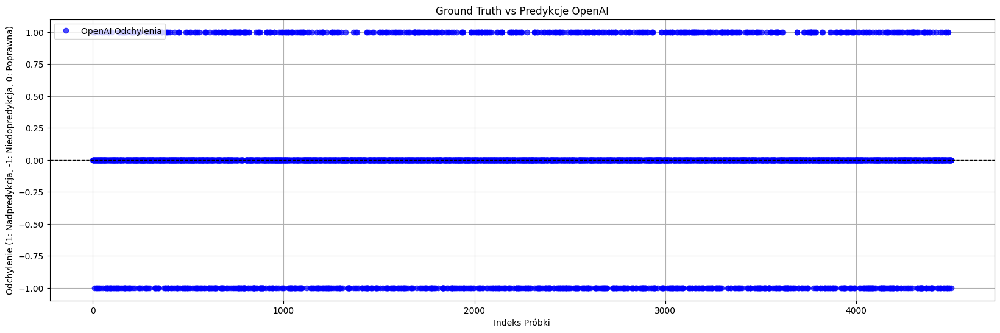
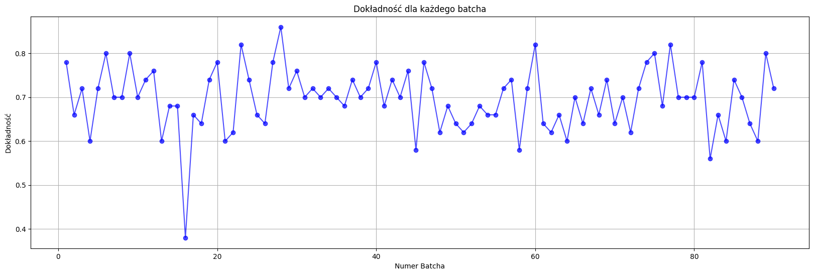

# Analiza Sentymentu na Twitterze

## Opis

Ten projekt ma na celu analizę sentymentów na podstawie tweetów z Twittera. Model oparty jest na sieci neuronowej LSTM (Long Short-Term Memory), która klasyfikuje teksty jako pozytywne lub negatywne na podstawie ich treści.

### Cele Projektu:
- Pobranie i przetworzenie danych z Twittera.
- Zbudowanie i wytrenowanie modelu LSTM do analizy sentymentu.
- Ocena dokładności modelu na zbiorach treningowym, walidacyjnym i testowym.
- Wizualizacja wyników w postaci wykresów oraz przykładowych predykcji.

## Struktura Projektu

1. **Importowanie bibliotek**  
   W tym kroku zaimportowano niezbędne biblioteki, takie jak `tensorflow`, `pandas`, `numpy` i inne, które są wymagane do przetwarzania danych i budowy modelu.

2. **Pobieranie i przetwarzanie danych**  
   Datasets zostały pobrane z linków GitHub i przygotowane do analizy. Dane są przetwarzane i dzielone na zbiory: treningowy, walidacyjny i testowy.

3. **Przygotowanie danych**  
   Przekształcone dane zostały tokenizowane, a teksty zostały zamienione na sekwencje liczb, które są następnie uzupełniane do stałej długości.

4. **Budowanie i trenowanie modelu**  
   Zbudowano model LSTM, który jest trenowany na zbiorze treningowym. Model składa się z warstw `Embedding`, `LSTM`, oraz `Dense`.

5. **Ocena i wizualizacja wyników**  
   Po przetrenowaniu modelu, dokładność jest oceniana na zbiorze testowym. Dodatkowo, generowane są wykresy ilustrujące dokładność modelu na różnych etapach treningu.

6. **Predykcje**  
   Na końcu przedstawiono przykłady predykcji na nowych danych, porównując je z rzeczywistymi etykietami.

7. **Usuwanie plików**  
   Na koniec, po zakończeniu analizy, pliki JSONL utworzone podczas przetwarzania danych są usuwane.

## Wyniki
**Dokładność treningowa i walidacyjna podczas trenowania:**  

- Przy występowaniu większej liczby epok w modelu występuje przeuczenie. Z tego powodu zastosowana została funkcja EarlyStopping, która przywraca najlepszą wagę modelu podczas jego uczenia.

**Wykres dokładności:**  

- Mimo wrostu dokładności przy uczeniu na danych treningowych dokładność walidacyjna po pewnym czasie maleje.

**Dokładność testowa:**  

accuracy: 0.7902 - loss: 0.4486  
Dokładność na zbiorze testowym: 0.79

**Wyświetlamy przykładowe predykcje i rzeczywiste etykiety:**  

Przykładowe predykcje:  

 - Tweet: @justineville ...yeahhh. i'm 39 tweets from 1,600!  
   Predykcja: Negatywna, Rzeczywista etykieta: Negatywna

 - Tweet: @ApplesnFeathers aww. Poor baby! On your only REAL day off.  
   Predykcja: Pozytywna, Rzeczywista etykieta: Pozytywna

 - Tweet: @joeymcintyre With my refunded $225 (Australian ticket price) I bought me a hot pair of brown boots  Woulda rathered seeing U any day  
   Predykcja: Pozytywna, Rzeczywista etykieta: Negatywna

 - Tweet: It's fine. Today sucks just because me those things. i dunno if i can see you  
   Predykcja: Pozytywna, Rzeczywista etykieta: Pozytywna

 - Tweet: Im just chilling on psp and stuff, but sitting on pc now, also watching wimledon, getting ready for holiday @WhiteTigerNora Ahh poor you  
   Predykcja: Negatywna, Rzeczywista etykieta: Negatywna

 - Tweet: @lisarinna very sad Lisa...she is freeeeeeeeeeee an Angel in Heaven xoxo  
   Predykcja: Negatywna, Rzeczywista etykieta: Negatywna

 - Tweet: Comfortablity has won out  
   Predykcja: Negatywna, Rzeczywista etykieta: Pozytywna

 - Tweet: blaaah. I don't feel good aagain  
   Predykcja: Negatywna, Rzeczywista etykieta: Pozytywna

**W projekcie przeprowadzono także unit testy, które sprawdzają różne etapy przetwarzania danych oraz trenowania modelu:**

1. Tokenizacja i dopełnianie sekwencji: Testy sprawdzają, czy sekwencje mają odpowiedni kształt i długość oraz czy każdy token jest liczbą całkowitą.
2. Podział danych: Testy weryfikują poprawność podziału danych na zbiory treningowy i walidacyjny.
3. Struktura plików JSONL: Testy sprawdzają, czy pliki JSONL są tworzone z odpowiednią strukturą.

Wszystkie testy przeszły pomyślnie, co potwierdza poprawność przetwarzania danych oraz trenowania modelu.

## Integracja z OpenAI API do analizy sentymentu

W ramach rozszerzenia projektu, zastosowaliśmy OpenAI API do analizy sentymentu na podstawie tweetów. Dzięki temu, przy użyciu zaawansowanych modeli językowych, takich jak GPT-4o-mini, możemy przeprowadzać klasyfikację sentymentu w tekstach, przydzielając im etykiety "pozytywne" lub "negatywne" na podstawie treści tweetów.

#### Cele integracji:
- Wykorzystanie OpenAI API do klasyfikacji sentymentu tweetów.
- Porównanie wyników klasyfikacji między modelem LSTM a modelem OpenAI.
- Użycie OpenAI API do uzyskania wyników na większej liczbie tweetów.

#### Proces integracji:
1. **Pobieranie tweetów**: Tweetów używanych w projekcie nie przetwarzamy wyłącznie za pomocą klasycznego modelu LSTM, ale także za pomocą OpenAI API do klasyfikacji ich sentymentu. Zdecydowaliśmy się przeprowadzić klasyfikację za pomocą OpenAI API dobierając losową próbę - 4500 próbek.
   
2. **Wykorzystanie OpenAI API**: OpenAI API umożliwia wysyłanie tweetów w formie tekstów do udostępnionych modeli, którę dokonują klasyfikacji na podstawie zawartości każdego z tych tekstów. My zdecydowaliśmy się na model gpt-4o-mini ze względu na jego budżetowość i szybkośc działania.

3. **Zastosowanie przetwarzania w partiach**: Aby efektywnie wykorzystać OpenAI, zastosowaliśmy przetwarzanie w partiach (batch processing). Dzięki temu możliwe jest jednoczesne przetwarzanie wielu tweetów, co poprawia wydajność i skraca czas oczekiwania na odpowiedzi. 'Batche', w naszym przypadku, składają się z 50 tweetów. Wysyłamy więc 90 requestów. Zauważyliśmy, że gpt-4o-mini lepiej radzi sobie z mniejszymi partiami - stąd ta liczba.

4. **Porównanie z wynikami modelu LSTM**: Po uzyskaniu wyników analizy sentymentu z OpenAI, porównujemy je z wynikami uzyskanymi z modelu LSTM. Dokładność modelu OpenAI jest obliczana na podstawie zbioru testowego i porównywana z dokładnością uzyskaną przez model LSTM.

**Wykres Ground Truth:**

**Wykres dokładności OpenAI z uwzględnieniem batchy:**

**Ogólna dokładność OpenAI API:** 0.70
Model LSTM, uczony przez nas wcześniej, miał dokładnośc na poziomie 0.79 (Większy zbiór danych).

## Wymagania

- Python 3.x
- TensorFlow
- NumPy
- Pandas
- Matplotlib
- Datasets (Hugging Face)
